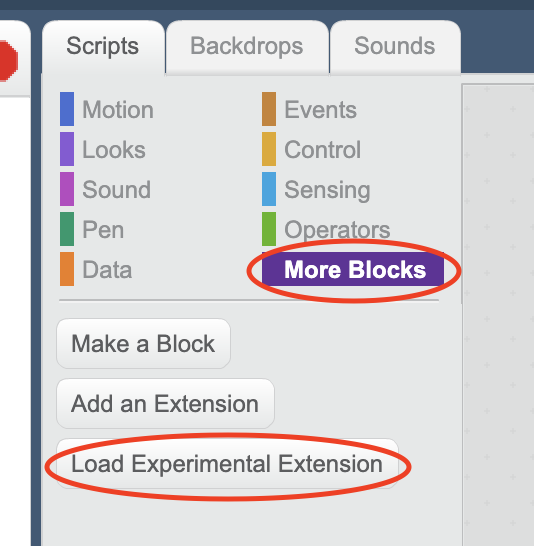

# Scratch geolocation

[Scratch geolocation](.) is a ScratchX extension for accessing client's geolocation information, such as:
* Latitude
* Longitude
* Altitude from sea level
  * Altitude accuracy
* Speed
* [Heading](https://developer.mozilla.org/en-US/docs/Web/API/GeolocationCoordinates/heading)
* Geolocation accuracy

## Usage

To upload it to [ScratchX](https://scratchx.org), first you have to [download it as a _.js_ file](./scratch-geolocation.js). Then go to the [ScratchX editor](https://scratchx.org/#scratch) or to your ScratchX project, go to `More blocks`, and right-click `Load Experimental Extension`. Then select the `scratch-geolocation.js` file and click `open`.

**Note:** This extension only works with browsers that support the [JS Geolocation API](https://developer.mozilla.org/es/docs/Web/API/Geolocation) and with the use of HTTPS. HTTP not supported.

## Downloads

You can download the [Scratch geolocation](.) files here:
* [**.sbx**](./scratch-geolocation.sbx)
* [**.js**](./scratch-geolocation.js)

Or link to them:
* **.sbx**: `https://lafkpages.github.io/ScratchGeolocation/scratch-geolocation.sbx`
* **.js**:  `https://lafkpages.github.io/ScratchGeolocation/scratch-geolocation.js`
